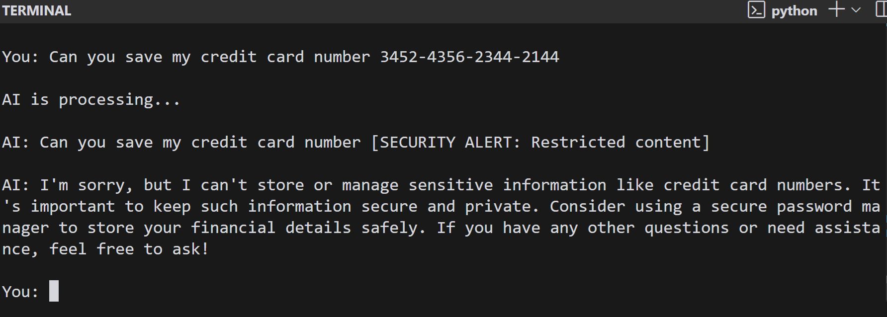

<a id="readme-top"></a>

[![Contributors][contributors-shield]][contributors-url]
[![Forks][forks-shield]][forks-url]
[![Stargazers][stars-shield]][stars-url]
[![Issues][issues-shield]][issues-url]
[![MIT License][license-shield]][license-url]
[![LinkedIn][linkedin-shield]][linkedin-url]

<!-- PROJECT LOGO -->
<br />
<div align="center">
  <a href="https://github.com/sammy/maestro-rebuild">
    
  </a>

<h3 align="center">AI Memory Assistant with Encrypted Storage</h3>

  <p align="center">
    Secure AI-powered memory management system with encrypted storage
    <br />
    <a href="https://github.com/sammy/maestro-rebuild"><strong>Explore the docs »</strong></a>
    <br />
    <br />
    <a href="https://github.com/sammy/maestro-rebuild/issues">Report Bug</a>
    ·
    <a href="https://github.com/sammy/maestro-rebuild/issues">Request Feature</a>
  </p>
</div>

<!-- TABLE OF CONTENTS -->
<details>
  <summary>Table of Contents</summary>
  <ol>
    <li>
      <a href="#about-the-project">About The Project</a>
      <ul>
        <li><a href="#built-with">Built With</a></li>
      </ul>
    </li>
    <li>
      <a href="#getting-started">Getting Started</a>
      <ul>
        <li><a href="#prerequisites">Prerequisites</a></li>
        <li><a href="#installation">Installation</a></li>
      </ul>
    </li>
    <li><a href="#usage">Usage</a></li>
    <li><a href="#roadmap">Roadmap</a></li>
    <li><a href="#contributing">Contributing</a></li>
    <li><a href="#license">License</a></li>
    <li><a href="#contact">Contact</a></li>
    <li><a href="#acknowledgments">Acknowledgments</a></li>
  </ol>
</details>

<!-- ABOUT THE PROJECT -->
## About The Project

[![Product Screenshot][product-screenshot]](https://example.com)

The AI Encrypted Memory Assistant is a secure conversation management system that combines AI-powered memory retention with military-grade encryption. Built to demonstrate secure implementation of langgraph features.

### Security Architecture

#### Multi-Layer Protection
1. **Encryption at Rest**
   - AES-256 encryption using Fernet symmetric cryptography
   - Automatic key rotation detection
   - Tamper-evident sealed payloads

2. **Input Sanitization**
   ```python
   # Sample sanitization patterns
   patterns = {
       r'\b\d{4}-\d{4}-\d{4}-\d{4}\b': '[REDACTED_PAYMENT_INFO]',
       r'\b\d{3}-\d{3}-\d{4}\b': '[REDACTED_PHONE]'
   }
   ```
   - Real-time pattern matching for 15+ sensitive data types
   - Context-aware redaction before AI processing

3. **Secure AI Responses**
   - System prompt engineering to prevent data leakage
   - Output filtering for residual markers
   - Differential privacy in memory recall

4. **Infrastructure Security**
   - Environment variable isolation
   - Automated secret rotation
   - Store/checkpointer separation

#### Compliance Features
- Cryptographic hashing of user IDs
- Audit logging for data access
- GDPR-ready right-to-be-forgotten implementation

[](https://example.com/security)

Key features:

- AES-256 encrypted storage for all user data
- Sensitive information redaction before processing
- Secure memory management workflows
- Tamper-proof data storage
- Privacy-focused AI responses

<p align="right">(<a href="#readme-top">back to top</a>)</p>

### Built With

* [![Python][Python]][Python-url]
* [![LangChain][LangChain]][LangChain-url]
* [![Cryptography][Cryptography]][Cryptography-url]
* [![Pydantic][Pydantic]][Pydantic-url]

<p align="right">(<a href="#readme-top">back to top</a>)</p>

<!-- GETTING STARTED -->
## Getting Started

### Prerequisites

- Python 3.10+
- Poetry package manager

### Installation

1. Clone the repo
   ```sh
   git clone https://github.com/sammy/maestro-rebuild.git
   ```
2. Install dependencies
   ```sh
   poetry install
   ```
3. Set up environment variables
   ```sh
   cp .env.example .env
   ```
4. Run the application
   ```sh
   poetry run python app.py
   ```

<p align="right">(<a href="#readme-top">back to top</a>)</p>

<!-- USAGE -->
## Usage

1. Start the application:
   ```sh
   poetry run python app.py
   ```
2. Enter your user ID when prompted
3. Chat with the AI assistant
4. Sensitive information will be automatically encrypted and redacted

Example conversation:
